# 생물 도감 (233종)

모든 스프라이트는 오른쪽을 바라보는 게임 해상도 원본이며, 런타임이 왼쪽으로 갈 때만 뒤집는다.

| 그림 | ID | 이름 | 동작 | 시간대 | 프레임 | 발광 |
|---|---|---|---|---|---|---|
|  | `clownfish` | 흰동가리 (Clownfish) | 꼬리 물결 유영 | 낮 | 6 |  |
| 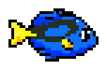 | `blue-tang` | 블루탱 (Blue tang) | 꼬리 물결 유영 | 낮 | 6 |  |
| 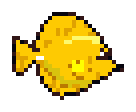 | `yellow-tang` | 옐로탱 (Yellow tang) | 꼬리 물결 유영 | 낮 | 6 |  |
| 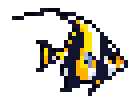 | `moorish-idol` | 깃대돔 (Moorish idol) | 꼬리 물결 유영 | 낮 | 6 |  |
| 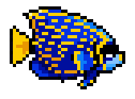 | `emperor-angelfish` | 황제에인절피시 (Emperor angelfish) | 꼬리 물결 유영 | 낮 | 6 |  |
| 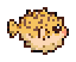 | `pufferfish` | 복어 (Pufferfish) | 통통 부푸는 유영 | 낮·밤 | 6 |  |
| 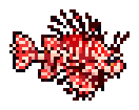 | `lionfish` | 쏠배감펭 (Lionfish) | 꼬리 물결 유영 | 낮·밤 | 6 |  |
| 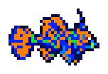 | `mandarinfish` | 만다린피시 (Mandarinfish) | 꼬리 물결 유영 | 낮 | 6 |  |
|  | `sardine` | 정어리 (Sardine) | 무리 유영 | 낮 | 4 |  |
| 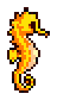 | `seahorse` | 해마 (Seahorse) | 제자리 부유 | 낮·밤 | 6 |  |
|  | `moon-jelly` | 보름달물해파리 (Moon jelly) | 갓 수축 추진 | 낮·밤 | 8 | 예 |
| 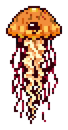 | `sea-nettle` | 태평양쐐기해파리 (Sea nettle) | 갓 수축 추진 | 낮·밤 | 8 |  |
| 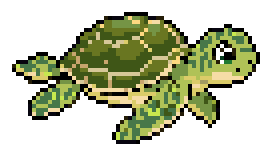 | `green-turtle` | 푸른바다거북 (Green sea turtle) | 지느러미 활공 | 낮 | 8 |  |
| 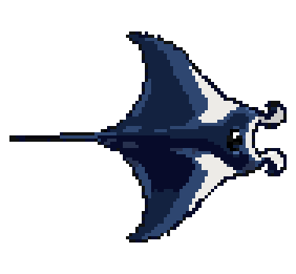 | `manta-ray` | 쥐가오리 (Manta ray) | 날개 펄럭임 | 낮·밤 | 8 |  |
| 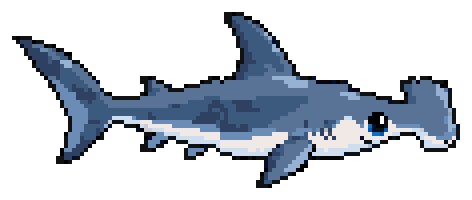 | `hammerhead` | 귀상어 (Hammerhead shark) | 느린 대형 유영 | 낮·밤 | 8 |  |
| 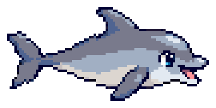 | `dolphin` | 큰돌고래 (Bottlenose dolphin) | 느린 대형 유영 | 낮 | 8 |  |
|  | `octopus` | 문어 (Octopus) | 다리 물결 추진 | 밤 | 8 |  |
|  | `red-crab` | 홍게 (Red crab) | 바닥 옆걸음 | 낮·밤 | 4 |  |
| 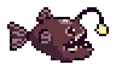 | `anglerfish` | 초롱아귀 (Anglerfish) | 꼬리 물결 유영 | 밤 | 6 | 예 |
| 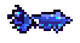 | `firefly-squid` | 반딧불오징어 (Firefly squid) | 분사 추진 | 밤 | 6 | 예 |
| 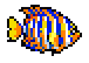 | `regal-angelfish` | 리갈엔젤피시 (Regal angelfish) | 꼬리 물결 유영 | 낮 | 6 |  |
| 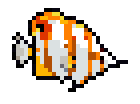 | `copperband-butterflyfish` | 코퍼밴드나비고기 (Copperband butterflyfish) | 꼬리 물결 유영 | 낮 | 6 |  |
| 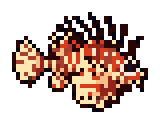 | `spotfin-lionfish` | 스팟핀쏠배감펭 (Spotfin lionfish) | 꼬리 물결 유영 | 낮·밤 | 6 |  |
| 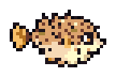 | `spiny-porcupinefish` | 가시복 (Spiny porcupinefish) | 통통 부푸는 유영 | 낮·밤 | 6 |  |
| 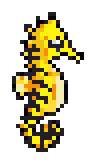 | `tiger-tail-seahorse` | 호랑이꼬리해마 (Tiger tail seahorse) | 제자리 부유 | 낮·밤 | 6 |  |
|  | `blue-moon-jelly` | 푸른보름달해파리 (Blue moon jelly) | 갓 수축 추진 | 낮·밤 | 8 | 예 |
| 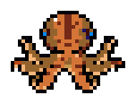 | `california-two-spot-octopus` | 두점박이문어 (California two-spot octopus) | 다리 물결 추진 | 밤 | 8 |  |
| 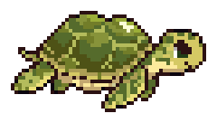 | `olive-ridley-sea-turtle` | 올리브각시바다거북 (Olive ridley sea turtle) | 지느러미 활공 | 낮 | 8 |  |
| 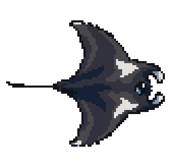 | `reef-manta-ray` | 암초쥐가오리 (Reef manta ray) | 날개 펄럭임 | 낮·밤 | 8 |  |
| 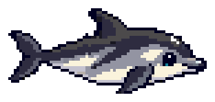 | `pacific-white-sided-dolphin` | 낫돌고래 (Pacific white-sided dolphin) | 느린 대형 유영 | 낮 | 8 |  |
|  | `tomato-clownfish` | 토마토흰동가리 (Tomato clownfish) | 꼬리 물결 유영 | 낮 | 6 |  |
| 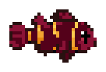 | `maroon-clownfish` | 마룬흰동가리 (Maroon clownfish) | 꼬리 물결 유영 | 낮 | 6 |  |
|  | `black-clownfish` | 검은흰동가리 (Black clownfish) | 꼬리 물결 유영 | 낮 | 6 |  |
| 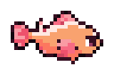 | `pink-skunk-clownfish` | 핑크스컹크흰동가리 (Pink skunk clownfish) | 꼬리 물결 유영 | 낮 | 6 |  |
| 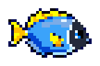 | `powder-blue-tang` | 파우더블루탱 (Powder blue tang) | 꼬리 물결 유영 | 낮 | 6 |  |
| 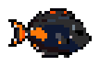 | `achilles-tang` | 아킬레스탱 (Achilles tang) | 꼬리 물결 유영 | 낮 | 6 |  |
| 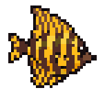 | `sailfin-tang` | 세일핀탱 (Sailfin tang) | 꼬리 물결 유영 | 낮 | 6 |  |
| 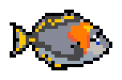 | `orange-shoulder-tang` | 오렌지숄더탱 (Orange shoulder tang) | 꼬리 물결 유영 | 낮 | 6 |  |
| 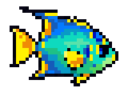 | `queen-angelfish` | 퀸엔젤피시 (Queen angelfish) | 꼬리 물결 유영 | 낮 | 6 |  |
| 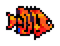 | `flame-angelfish` | 플레임엔젤피시 (Flame angelfish) | 꼬리 물결 유영 | 낮 | 6 |  |
| 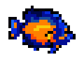 | `coral-beauty-angelfish` | 코랄뷰티엔젤피시 (Coral beauty angelfish) | 꼬리 물결 유영 | 낮 | 6 |  |
| 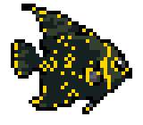 | `french-angelfish` | 프렌치엔젤피시 (French angelfish) | 꼬리 물결 유영 | 낮 | 6 |  |
| 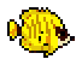 | `raccoon-butterflyfish` | 라쿤나비고기 (Raccoon butterflyfish) | 꼬리 물결 유영 | 낮 | 6 |  |
| 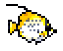 | `threadfin-butterflyfish` | 실지느러미나비고기 (Threadfin butterflyfish) | 꼬리 물결 유영 | 낮 | 6 |  |
| 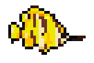 | `longnose-butterflyfish` | 롱노즈나비고기 (Longnose butterflyfish) | 꼬리 물결 유영 | 낮 | 6 |  |
| 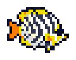 | `chevron-butterflyfish` | 셰브론나비고기 (Chevron butterflyfish) | 꼬리 물결 유영 | 낮 | 6 |  |
| 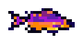 | `fairy-wrasse` | 요정놀래기 (Fairy wrasse) | 꼬리 물결 유영 | 낮 | 6 |  |
| 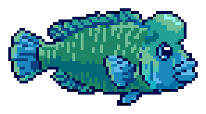 | `humphead-wrasse` | 나폴레옹피시 (Humphead wrasse) | 꼬리 물결 유영 | 낮 | 6 |  |
|  | `cleaner-wrasse` | 청줄청소놀래기 (Cleaner wrasse) | 꼬리 물결 유영 | 낮 | 6 |  |
| 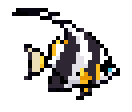 | `bannerfish` | 두동가리돔 (Bannerfish) | 꼬리 물결 유영 | 낮 | 6 |  |
| 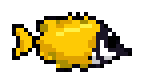 | `foxface-rabbitfish` | 여우얼굴독가시치 (Foxface rabbitfish) | 꼬리 물결 유영 | 낮 | 6 |  |
| 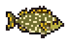 | `spotted-rabbitfish` | 점박이독가시치 (Spotted rabbitfish) | 꼬리 물결 유영 | 낮 | 6 |  |
|  | `purple-firefish` | 퍼플파이어피시 (Purple firefish) | 꼬리 물결 유영 | 낮 | 6 |  |
| 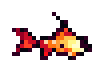 | `red-firefish` | 레드파이어피시 (Red firefish) | 꼬리 물결 유영 | 낮 | 6 |  |
| 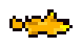 | `yellow-watchman-goby` | 노랑망둑 (Yellow watchman goby) | 꼬리 물결 유영 | 낮 | 6 |  |
|  | `neon-goby` | 네온망둑 (Neon goby) | 꼬리 물결 유영 | 낮 | 6 |  |
|  | `pajama-cardinalfish` | 파자마카디널 (Pajama cardinalfish) | 꼬리 물결 유영 | 밤 | 6 |  |
| 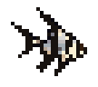 | `banggai-cardinalfish` | 방가이카디널 (Banggai cardinalfish) | 꼬리 물결 유영 | 낮 | 6 |  |
|  | `blue-green-chromis` | 청록자리돔 (Blue-green chromis) | 무리 유영 | 낮 | 4 |  |
| 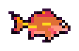 | `sunset-anthias` | 선셋안티아스 (Sunset anthias) | 꼬리 물결 유영 | 낮 | 6 |  |
|  | `anchovy` | 멸치 (Anchovy) | 무리 유영 | 낮 | 4 |  |
|  | `atlantic-herring` | 청어 (Atlantic herring) | 무리 유영 | 낮 | 4 |  |
|  | `pacific-mackerel` | 고등어 (Pacific mackerel) | 무리 유영 | 낮 | 4 |  |
| 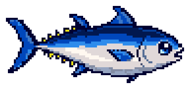 | `bluefin-tuna` | 참다랑어 (Bluefin tuna) | 느린 대형 유영 | 낮 | 8 |  |
| 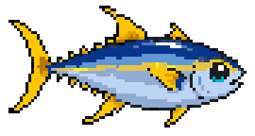 | `yellowfin-tuna` | 황다랑어 (Yellowfin tuna) | 느린 대형 유영 | 낮 | 8 |  |
| 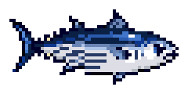 | `skipjack-tuna` | 가다랑어 (Skipjack tuna) | 꼬리 물결 유영 | 낮 | 6 |  |
|  | `mahi-mahi` | 만새기 (Mahi mahi) | 꼬리 물결 유영 | 낮 | 6 |  |
|  | `flying-fish` | 날치 (Flying fish) | 꼬리 물결 유영 | 낮 | 6 |  |
|  | `needlefish` | 동갈치 (Needlefish) | 꼬리 물결 유영 | 낮 | 6 |  |
|  | `barracuda` | 창꼬치 (Barracuda) | 꼬리 물결 유영 | 낮·밤 | 6 |  |
|  | `swordfish` | 황새치 (Swordfish) | 느린 대형 유영 | 낮·밤 | 8 |  |
|  | `opah-moonfish` | 붉평치 (Opah moonfish) | 꼬리 물결 유영 | 낮·밤 | 6 |  |
|  | `giant-trevally` | 무명갈전갱이 (Giant trevally) | 꼬리 물결 유영 | 낮 | 6 |  |
|  | `blue-marlin` | 청새치 (Blue marlin) | 느린 대형 유영 | 낮 | 8 |  |
|  | `great-white-shark` | 백상아리 (Great white shark) | 느린 대형 유영 | 낮·밤 | 8 |  |
|  | `tiger-shark` | 뱀상어 (Tiger shark) | 느린 대형 유영 | 낮·밤 | 8 |  |
|  | `blacktip-reef-shark` | 흑기흉상어 (Blacktip reef shark) | 느린 대형 유영 | 낮 | 8 |  |
|  | `whitetip-reef-shark` | 백기흉상어 (Whitetip reef shark) | 느린 대형 유영 | 밤 | 8 |  |
|  | `zebra-shark` | 얼룩말상어 (Zebra shark) | 느린 대형 유영 | 낮·밤 | 8 |  |
|  | `leopard-shark` | 레오파드상어 (Leopard shark) | 느린 대형 유영 | 낮·밤 | 8 |  |
|  | `nurse-shark` | 너스상어 (Nurse shark) | 느린 대형 유영 | 밤 | 8 |  |
|  | `epaulette-shark` | 견장상어 (Epaulette shark) | 바닥 기어가기 | 밤 | 4 |  |
|  | `thresher-shark` | 환도상어 (Thresher shark) | 느린 대형 유영 | 낮·밤 | 8 |  |
|  | `mako-shark` | 청상아리 (Mako shark) | 느린 대형 유영 | 낮·밤 | 8 |  |
|  | `sand-tiger-shark` | 모래뱀상어 (Sand tiger shark) | 느린 대형 유영 | 밤 | 8 |  |
|  | `greenland-shark` | 그린란드상어 (Greenland shark) | 느린 대형 유영 | 밤 | 8 |  |
|  | `spotted-eagle-ray` | 점박이매가오리 (Spotted eagle ray) | 날개 펄럭임 | 낮 | 8 |  |
|  | `cownose-ray` | 소코가오리 (Cownose ray) | 날개 펄럭임 | 낮 | 8 |  |
|  | `bat-ray` | 박쥐가오리 (Bat ray) | 날개 펄럭임 | 낮·밤 | 8 |  |
|  | `electric-ray` | 전기가오리 (Electric ray) | 날개 펄럭임 | 밤 | 8 |  |
|  | `spinner-dolphin` | 스피너돌고래 (Spinner dolphin) | 느린 대형 유영 | 낮 | 8 |  |
|  | `harbor-porpoise` | 쥐돌고래 (Harbor porpoise) | 느린 대형 유영 | 낮 | 8 |  |
|  | `vaquita` | 바키타 (Vaquita) | 느린 대형 유영 | 낮 | 8 |  |
|  | `sea-otter` | 해달 (Sea otter) | 지느러미 활공 | 낮 | 8 |  |
|  | `harbor-seal` | 잔점박이물범 (Harbor seal) | 지느러미 활공 | 낮·밤 | 8 |  |
|  | `california-sea-lion` | 캘리포니아바다사자 (California sea lion) | 지느러미 활공 | 낮 | 8 |  |
|  | `walrus` | 바다코끼리 (Walrus) | 지느러미 활공 | 낮·밤 | 8 |  |
|  | `lions-mane-jelly` | 사자갈기해파리 (Lion's mane jelly) | 갓 수축 추진 | 낮·밤 | 8 |  |
|  | `compass-jelly` | 컴퍼스해파리 (Compass jelly) | 갓 수축 추진 | 낮·밤 | 8 |  |
|  | `blue-blubber-jelly` | 블루블러버해파리 (Blue blubber jelly) | 갓 수축 추진 | 낮·밤 | 8 |  |
|  | `flower-hat-jelly` | 꽃모자해파리 (Flower hat jelly) | 갓 수축 추진 | 밤 | 8 | 예 |
|  | `upside-down-jelly` | 거꾸로해파리 (Upside-down jelly) | 갓 수축 추진 | 낮·밤 | 8 |  |
|  | `box-jellyfish` | 상자해파리 (Box jellyfish) | 갓 수축 추진 | 낮·밤 | 8 |  |
|  | `blue-ringed-octopus` | 파란고리문어 (Blue-ringed octopus) | 다리 물결 추진 | 밤 | 8 | 예 |
|  | `dumbo-octopus` | 덤보문어 (Dumbo octopus) | 다리 물결 추진 | 밤 | 8 |  |
|  | `blanket-octopus` | 담요문어 (Blanket octopus) | 다리 물결 추진 | 낮·밤 | 8 |  |
|  | `common-cuttlefish` | 갑오징어 (Common cuttlefish) | 분사 추진 | 낮·밤 | 6 |  |
|  | `flamboyant-cuttlefish` | 화려한갑오징어 (Flamboyant cuttlefish) | 분사 추진 | 낮 | 6 |  |
|  | `reef-squid` | 흰오징어 (Reef squid) | 분사 추진 | 밤 | 6 |  |
|  | `vampire-squid` | 흡혈오징어 (Vampire squid) | 다리 물결 추진 | 밤 | 8 | 예 |
|  | `giant-clam` | 대왕조개 (Giant clam) | 바닥에 붙어 흔들림 | 낮·밤 | 8 |  |
|  | `scallop` | 가리비 (Scallop) | 바닥에 붙어 흔들림 | 낮·밤 | 8 |  |
|  | `abalone` | 전복 (Abalone) | 바닥에 붙어 흔들림 | 낮·밤 | 8 |  |
|  | `chambered-nautilus` | 앵무조개 (Chambered nautilus) | 분사 추진 | 밤 | 6 |  |
|  | `king-crab` | 왕게 (King crab) | 바닥 옆걸음 | 낮·밤 | 4 |  |
|  | `coconut-crab` | 야자집게 (Coconut crab) | 바닥 옆걸음 | 낮·밤 | 4 |  |
|  | `hermit-crab` | 소라게 (Hermit crab) | 바닥 기어가기 | 낮·밤 | 4 |  |
|  | `horseshoe-crab` | 투구게 (Horseshoe crab) | 바닥 기어가기 | 낮·밤 | 4 |  |
|  | `spiny-lobster` | 닭새우 (Spiny lobster) | 바닥 기어가기 | 밤 | 4 |  |
|  | `mantis-shrimp` | 갯가재 (Mantis shrimp) | 바닥 기어가기 | 낮·밤 | 4 |  |
|  | `cleaner-shrimp` | 청소새우 (Cleaner shrimp) | 바닥 기어가기 | 낮·밤 | 4 |  |
|  | `pistol-shrimp` | 딱총새우 (Pistol shrimp) | 바닥 기어가기 | 낮·밤 | 4 |  |
|  | `red-sea-star` | 빨강불가사리 (Red sea star) | 바닥에 붙어 흔들림 | 낮·밤 | 8 |  |
|  | `sunflower-sea-star` | 해바라기불가사리 (Sunflower sea star) | 바닥에 붙어 흔들림 | 낮·밤 | 8 |  |
|  | `purple-sea-urchin` | 보라성게 (Purple sea urchin) | 바닥에 붙어 흔들림 | 낮·밤 | 8 |  |
|  | `sea-cucumber` | 해삼 (Sea cucumber) | 바닥 기어가기 | 낮·밤 | 4 |  |
|  | `black-dragonfish` | 검은용고기 (Black dragonfish) | 온몸 물결 유영 | 밤 | 6 | 예 |
|  | `viperfish` | 독사고기 (Viperfish) | 꼬리 물결 유영 | 밤 | 6 | 예 |
|  | `silver-hatchetfish` | 은도끼고기 (Silver hatchetfish) | 무리 유영 | 밤 | 4 | 예 |
|  | `lanternfish` | 샛비늘치 (Lanternfish) | 무리 유영 | 밤 | 4 | 예 |
|  | `flashlight-fish` | 등불고기 (Flashlight fish) | 꼬리 물결 유영 | 밤 | 6 | 예 |
|  | `fangtooth` | 송곳니고기 (Fangtooth) | 꼬리 물결 유영 | 밤 | 6 |  |
|  | `gulper-eel` | 풍선장어 (Gulper eel) | 온몸 물결 유영 | 밤 | 6 |  |
|  | `barreleye-fish` | 통안어 (Barreleye fish) | 꼬리 물결 유영 | 밤 | 6 |  |
|  | `tripod-fish` | 삼발이고기 (Tripod fish) | 바닥 기어가기 | 밤 | 4 |  |
|  | `giant-isopod` | 대왕구족충 (Giant isopod) | 바닥 기어가기 | 밤 | 4 |  |
|  | `sea-angel` | 바다천사 (Sea angel) | 제자리 부유 | 밤 | 6 | 예 |
|  | `rainbow-comb-jelly` | 무지개빗해파리 (Rainbow comb jelly) | 갓 수축 추진 | 밤 | 8 | 예 |
|  | `siphonophore` | 관해파리 (Siphonophore) | 온몸 물결 유영 | 밤 | 6 | 예 |
|  | `atolla-jelly` | 아톨라해파리 (Atolla jelly) | 갓 수축 추진 | 밤 | 8 | 예 |
|  | `glass-squid` | 유리오징어 (Glass squid) | 분사 추진 | 밤 | 6 | 예 |
|  | `leafy-seadragon` | 나뭇잎해룡 (Leafy seadragon) | 제자리 부유 | 낮·밤 | 6 |  |
|  | `weedy-seadragon` | 풀잎해룡 (Weedy seadragon) | 제자리 부유 | 낮·밤 | 6 |  |
|  | `pygmy-seahorse` | 피그미해마 (Pygmy seahorse) | 제자리 부유 | 낮·밤 | 6 |  |
|  | `longsnout-seahorse` | 주둥이긴해마 (Longsnout seahorse) | 제자리 부유 | 낮·밤 | 6 |  |
|  | `pipefish` | 실고기 (Pipefish) | 온몸 물결 유영 | 낮·밤 | 6 |  |
|  | `ornate-ghost-pipefish` | 유령실고기 (Ornate ghost pipefish) | 제자리 부유 | 낮·밤 | 6 |  |
|  | `seamoth` | 바다나방 (Seamoth) | 바닥 기어가기 | 낮·밤 | 4 |  |
|  | `flying-gurnard` | 쭉지성대 (Flying gurnard) | 바닥 기어가기 | 낮 | 4 |  |
|  | `zebra-moray-eel` | 얼룩말곰치 (Zebra moray eel) | 온몸 물결 유영 | 밤 | 6 |  |
|  | `snowflake-moray-eel` | 눈송이곰치 (Snowflake moray eel) | 온몸 물결 유영 | 밤 | 6 |  |
|  | `ribbon-eel` | 리본장어 (Ribbon eel) | 온몸 물결 유영 | 밤 | 6 |  |
|  | `wolf-eel` | 늑대장어 (Wolf eel) | 온몸 물결 유영 | 밤 | 6 |  |
|  | `garden-eel` | 정원장어 (Garden eel) | 바닥에 붙어 흔들림 | 낮 | 8 |  |
|  | `conger-eel` | 붕장어 (Conger eel) | 온몸 물결 유영 | 밤 | 6 |  |
|  | `pacific-hagfish` | 먹장어 (Pacific hagfish) | 온몸 물결 유영 | 밤 | 6 |  |
|  | `red-lipped-batfish` | 붉은입술부치 (Red-lipped batfish) | 바닥 기어가기 | 낮·밤 | 4 |  |
|  | `hairy-frogfish` | 털씬벵이 (Hairy frogfish) | 제자리 부유 | 낮·밤 | 6 |  |
|  | `reef-stonefish` | 쑤기미 (Reef stonefish) | 바닥 기어가기 | 낮·밤 | 4 |  |
|  | `stargazer-fish` | 얼룩통구멍 (Stargazer fish) | 바닥 기어가기 | 밤 | 4 |  |
|  | `scorpionfish` | 쏨뱅이 (Scorpionfish) | 꼬리 물결 유영 | 낮·밤 | 6 |  |
|  | `sea-toadfish` | 두꺼비고기 (Sea toadfish) | 바닥 기어가기 | 밤 | 4 |  |
|  | `flathead-fish` | 양태 (Flathead fish) | 바닥 기어가기 | 낮·밤 | 4 |  |
|  | `clown-triggerfish` | 광대쥐치 (Clown triggerfish) | 꼬리 물결 유영 | 낮 | 6 |  |
|  | `orange-spotted-filefish` | 오렌지점쥐치 (Orange-spotted filefish) | 꼬리 물결 유영 | 낮 | 6 |  |
|  | `yellow-boxfish` | 노랑거북복 (Yellow boxfish) | 통통 부푸는 유영 | 낮 | 6 |  |
|  | `longhorn-cowfish` | 뿔거북복 (Longhorn cowfish) | 통통 부푸는 유영 | 낮 | 6 |  |
|  | `bumphead-parrotfish` | 혹돔 (Bumphead parrotfish) | 꼬리 물결 유영 | 낮 | 6 |  |
|  | `zebra-surgeonfish` | 얼룩말쥐돔 (Zebra surgeonfish) | 꼬리 물결 유영 | 낮 | 6 |  |
|  | `coral-grouper` | 산호바리 (Coral grouper) | 꼬리 물결 유영 | 낮·밤 | 6 |  |
|  | `giant-sea-bass` | 자이언트농어 (Giant sea bass) | 느린 대형 유영 | 낮·밤 | 8 |  |
|  | `arctic-cod` | 북극대구 (Arctic cod) | 꼬리 물결 유영 | 낮·밤 | 6 |  |
|  | `antarctic-icefish` | 남극빙어 (Antarctic icefish) | 꼬리 물결 유영 | 낮·밤 | 6 |  |
|  | `pacific-spiny-lumpsucker` | 도치 (Pacific spiny lumpsucker) | 제자리 부유 | 낮·밤 | 6 |  |
|  | `snailfish` | 꼼치 (Snailfish) | 꼬리 물결 유영 | 밤 | 6 |  |
|  | `atlantic-halibut` | 대서양넙치 (Atlantic halibut) | 바닥 기어가기 | 낮·밤 | 4 |  |
|  | `peacock-flounder` | 공작가자미 (Peacock flounder) | 바닥 기어가기 | 낮·밤 | 4 |  |
|  | `dover-sole` | 도버서대기 (Dover sole) | 바닥 기어가기 | 낮·밤 | 4 |  |
|  | `turbot` | 터봇 (Turbot) | 바닥 기어가기 | 낮·밤 | 4 |  |
|  | `atlantic-salmon` | 대서양연어 (Atlantic salmon) | 꼬리 물결 유영 | 낮·밤 | 6 |  |
|  | `steelhead-trout` | 무지개송어 (Steelhead trout) | 꼬리 물결 유영 | 낮·밤 | 6 |  |
|  | `striped-bass` | 줄무늬농어 (Striped bass) | 꼬리 물결 유영 | 낮·밤 | 6 |  |
|  | `black-sea-bass` | 검은바다농어 (Black sea bass) | 꼬리 물결 유영 | 낮·밤 | 6 |  |
|  | `red-snapper` | 붉은퉁돔 (Red snapper) | 꼬리 물결 유영 | 낮 | 6 |  |
|  | `yellowtail-amberjack` | 방어 (Yellowtail amberjack) | 꼬리 물결 유영 | 낮 | 6 |  |
|  | `bigeye-tuna` | 눈다랑어 (Bigeye tuna) | 느린 대형 유영 | 낮·밤 | 8 |  |
|  | `bluefish` | 게르치 (Bluefish) | 꼬리 물결 유영 | 낮 | 6 |  |
|  | `spotted-wobbegong` | 점박이수염상어 (Spotted wobbegong) | 바닥 기어가기 | 밤 | 4 |  |
|  | `horn-shark` | 괭이상어 (Horn shark) | 바닥 기어가기 | 밤 | 4 |  |
|  | `swell-shark` | 두툽상어 (Swell shark) | 바닥 기어가기 | 밤 | 4 |  |
|  | `sawfish` | 톱가오리 (Sawfish) | 느린 대형 유영 | 낮·밤 | 8 |  |
|  | `shovelnose-guitarfish` | 삽코가래상어 (Shovelnose guitarfish) | 느린 대형 유영 | 낮·밤 | 8 |  |
|  | `southern-stingray` | 남방노랑가오리 (Southern stingray) | 날개 펄럭임 | 낮·밤 | 8 |  |
|  | `ornate-eagle-ray` | 장식매가오리 (Ornate eagle ray) | 날개 펄럭임 | 낮·밤 | 8 |  |
|  | `hawksbill-sea-turtle` | 매부리바다거북 (Hawksbill sea turtle) | 지느러미 활공 | 낮 | 8 |  |
|  | `leatherback-sea-turtle` | 장수거북 (Leatherback sea turtle) | 지느러미 활공 | 낮·밤 | 8 |  |
|  | `loggerhead-sea-turtle` | 붉은바다거북 (Loggerhead sea turtle) | 지느러미 활공 | 낮·밤 | 8 |  |
|  | `dugong` | 듀공 (Dugong) | 지느러미 활공 | 낮 | 8 |  |
|  | `west-indian-manatee` | 서인도매너티 (West Indian manatee) | 지느러미 활공 | 낮 | 8 |  |
|  | `steller-sea-lion` | 큰바다사자 (Steller sea lion) | 지느러미 활공 | 낮·밤 | 8 |  |
|  | `marine-iguana` | 바다이구아나 (Marine iguana) | 지느러미 활공 | 낮 | 8 |  |
|  | `chromatic-nudibranch` | 갯민숭달팽이 (Chromatic nudibranch) | 바닥 기어가기 | 낮·밤 | 4 |  |
|  | `spanish-dancer-nudibranch` | 스페인댄서 (Spanish dancer nudibranch) | 제자리 부유 | 낮·밤 | 6 |  |
|  | `blue-dragon-sea-slug` | 푸른갯민숭이 (Blue dragon sea slug) | 제자리 부유 | 낮·밤 | 6 |  |
|  | `california-sea-hare` | 군소 (California sea hare) | 바닥 기어가기 | 낮·밤 | 4 |  |
|  | `christmas-tree-worm` | 크리스마스트리웜 (Christmas tree worm) | 바닥에 붙어 흔들림 | 낮·밤 | 8 |  |
|  | `feather-duster-worm` | 깃털꽃갯지렁이 (Feather duster worm) | 바닥에 붙어 흔들림 | 낮·밤 | 8 |  |
|  | `giant-tube-worm` | 거대관벌레 (Giant tube worm) | 바닥에 붙어 흔들림 | 낮·밤 | 8 |  |
|  | `pink-sea-anemone` | 분홍말미잘 (Pink sea anemone) | 바닥에 붙어 흔들림 | 낮·밤 | 8 |  |
|  | `porcelain-crab` | 도자기게 (Porcelain crab) | 바닥 옆걸음 | 낮·밤 | 4 |  |
|  | `decorator-crab` | 꾸밈게 (Decorator crab) | 바닥 옆걸음 | 낮·밤 | 4 |  |
|  | `arrow-crab` | 화살게 (Arrow crab) | 바닥 옆걸음 | 낮·밤 | 4 |  |
|  | `brittle-star` | 거미불가사리 (Brittle star) | 바닥에 붙어 흔들림 | 낮·밤 | 8 |  |
|  | `sand-dollar` | 연잎성게 (Sand dollar) | 바닥에 붙어 흔들림 | 낮·밤 | 8 |  |
|  | `feather-star` | 갯고사리 (Feather star) | 바닥에 붙어 흔들림 | 낮·밤 | 8 |  |
|  | `sea-pen` | 바다조름 (Sea pen) | 바닥에 붙어 흔들림 | 낮·밤 | 8 |  |
|  | `elephant-fish` | 코끼리물고기 (Elephant fish) | 꼬리 물결 유영 | 낮·밤 | 6 |  |
|  | `whale-shark` | 고래상어 (Whale shark) | 느린 대형 유영 | 낮·밤 | 8 |  |
|  | `sunfish` | 개복치 (Ocean sunfish) | 느린 대형 유영 | 낮·밤 | 8 |  |
|  | `baby-turtle` | 새끼 바다거북 (Baby sea turtle) | 지느러미 활공 | 낮·밤 | 8 |  |
|  | `oarfish` | 산갈치 (Giant oarfish) | 꼬리 물결 유영 | 낮·밤 | 6 |  |
|  | `adelie-penguin` | 아델리펭귄 (Adélie penguin) | 지느러미 활공 | 낮·밤 | 8 |  |
|  | `haenyeo` | 해녀 (Haenyeo) | 꼬리 물결 유영 | 낮·밤 | 6 |  |
|  | `mermaid` | 인어공주 (Mermaid) | 꼬리 물결 유영 | 낮·밤 | 6 |  |
|  | `blue-whale` | 흰긴수염고래 (Blue whale) | 느린 대형 유영 | 낮·밤 | 8 |  |
|  | `humpback-whale` | 혹등고래 (Humpback whale) | 느린 대형 유영 | 낮·밤 | 8 |  |
|  | `orca` | 범고래 (Orca) | 느린 대형 유영 | 낮·밤 | 8 |  |
|  | `sperm-whale` | 향유고래 (Sperm whale) | 느린 대형 유영 | 낮·밤 | 8 |  |
|  | `beluga-whale` | 흰고래 (Beluga whale) | 느린 대형 유영 | 낮·밤 | 8 |  |
|  | `narwhal` | 일각고래 (Narwhal) | 느린 대형 유영 | 낮·밤 | 8 |  |
|  | `gray-whale` | 귀신고래 (Gray whale) | 느린 대형 유영 | 낮·밤 | 8 |  |
|  | `bowhead-whale` | 북극고래 (Bowhead whale) | 느린 대형 유영 | 낮·밤 | 8 |  |
|  | `minke-whale` | 밍크고래 (Minke whale) | 느린 대형 유영 | 낮·밤 | 8 |  |
